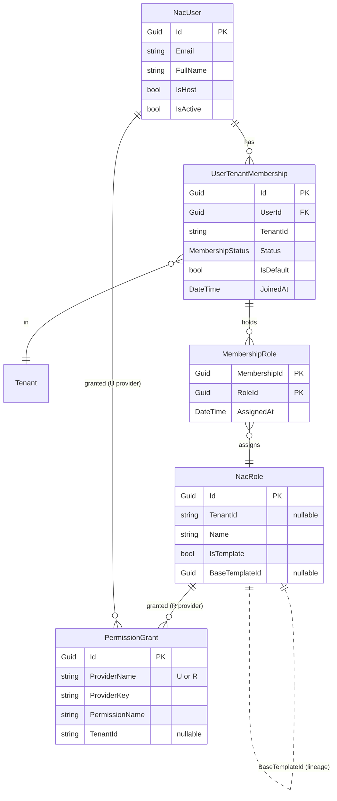
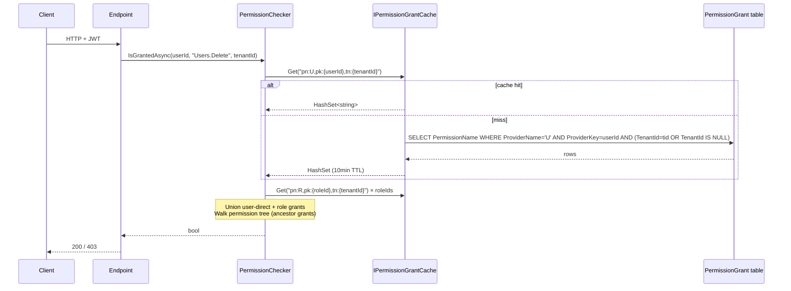
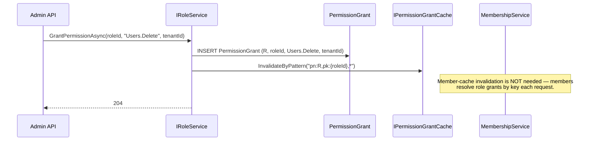

# NAC Framework — Identity & RBAC

> **Status:** v3.0 (Pattern A) — Ships in `Nac.Identity` + `Nac.Identity.Management`.
> **Audience:** Framework consumers integrating staff/admin identity.
> **Pre-release:** Breaking changes vs. v2. See [Migration](#9-migration-pre-release-reset).

## Table of Contents

1. [Mental Model](#1-mental-model)
2. [Schema](#2-schema)
3. [JWT Structure](#3-jwt-structure)
4. [Permission Evaluation](#4-permission-evaluation)
5. [Grant / Revoke Flow + Cache Invalidation](#5-grant--revoke-flow--cache-invalidation)
6. [Role Templates + Clone Recipe](#6-role-templates--clone-recipe)
7. [Customer Identity Pattern Guide](#7-customer-identity-pattern-guide)
8. [Host User Pattern](#8-host-user-pattern)
9. [Migration (Pre-release Reset)](#9-migration-pre-release-reset)
10. [Performance & Caching](#10-performance--caching)
11. [FAQ](#11-faq)
12. [Unresolved / Roadmap](#12-unresolved--roadmap)

---

## 1. Mental Model

NAC's identity layer is **Pattern A (portable user)**: one `NacUser` row globally, zero `TenantId` on the user, and tenant access mediated by `UserTenantMembership` (M:N). Roles are **tenant-scoped** and cloned from immutable **templates** at onboarding. Permissions live in an **ABP-style `PermissionGrant` table** (provider = `U` user or `R` role). JWTs are **minimal**: `sub`, `tenant_id`, `email`, `name`, `role_ids[]`, `is_host` — **no permission claims**. `PermissionChecker` resolves grants at check time against a cache-backed store (`IPermissionGrantCache` over `IDistributedCache`).

**Why this shape:**
- Users routinely serve multiple tenants (consultants, support, partners). Pattern A avoids duplicate user rows.
- Minimal JWTs stay under 2 KB and make revoke **instant** (no stale permission claims to outlive).
- ABP-style grants unify user-direct and role-granted permissions in one query.

---

## 2. Schema

### Entity-Relationship Diagram



### Key Facts

- **`NacUser.TenantId` does not exist.** A user is global.
- **`NacRole.TenantId`** is nullable: `null` = system template, non-null = tenant-scoped clone.
- **`PermissionGrant`** composite unique index: `(ProviderName, ProviderKey, PermissionName, TenantId)` — PG NULL-distinct.
- **`MembershipStatus`**: `Invited=0`, `Active=1`, `Suspended=2`, `Removed=3`.

### Permission Provider Keys

| ProviderName | ProviderKey holds | Semantic |
|---|---|---|
| `U` | User Id (Guid) | Grant applied directly to a user |
| `R` | Role Id (Guid) | Grant applied to a role (flows to all members) |

---

## 3. JWT Structure

### Claims

| Claim | Always present? | Source | Notes |
|---|---|---|---|
| `sub` (NameIdentifier) | yes | `NacUser.Id` | Guid string |
| `email` | yes | `NacUser.Email` | |
| `name` | if set | `NacUser.FullName` | |
| `tenant_id` | only on tenant-scoped token | `ITenantSwitchService` | absent on login-only token |
| `role_ids` | if any | membership's `MembershipRole` list | JSON array of Guid strings |
| `is_host` | only when `true` | `NacUser.IsHost` | |

Constants live in `src/Nac.Identity/Services/NacIdentityClaims.cs`:

```csharp
public static class NacIdentityClaims
{
    public const string TenantId = "tenant_id";
    public const string RoleIds  = "role_ids";
    public const string IsHost   = "is_host";
}
```

### Sample Payload

```json
{
  "sub":       "a1b2c3d4-0000-4000-8000-000000000001",
  "email":     "alice@example.com",
  "name":      "Alice Nguyen",
  "tenant_id": "acme",
  "role_ids":  ["6f0a...","2c91..."],
  "is_host":   false,
  "iat":       1700000000,
  "exp":       1700003600
}
```

### Token Lifecycle

1. `POST /auth/login` → **tenantless** token + `memberships[]`. Client picks a tenant.
2. `POST /auth/switch-tenant` → **tenant-scoped** token (`tenant_id` + `role_ids`).
3. Subsequent calls flow through `TenantRequiredGateMiddleware` which 403s tenant-scoped endpoints when `tenant_id` is absent.

Endpoints marked `[AllowTenantless]` bypass the gate (e.g. `/auth/login`, `/auth/memberships`, `/auth/switch-tenant`).

---

## 4. Permission Evaluation

### Sequence



### Pseudo-code

```csharp
public async Task<bool> IsGrantedAsync(Guid userId, string permission, string? tenantId, CancellationToken ct)
{
    var userGrants = await _cache.GetOrLoadAsync(
        UserKey(userId, tenantId),
        ct2 => _repo.QueryUserGrantsAsync(userId, tenantId, ct2),
        _ttl, ct);

    if (Matches(userGrants, permission)) return true;

    var roleIds = await _membership.GetRoleIdsAsync(userId, tenantId, ct);
    foreach (var roleId in roleIds)
    {
        var roleGrants = await _cache.GetOrLoadAsync(
            RoleKey(roleId, tenantId),
            ct2 => _repo.QueryRoleGrantsAsync(roleId, tenantId, ct2),
            _ttl, ct);
        if (Matches(roleGrants, permission)) return true;
    }
    return false;
}

static bool Matches(HashSet<string> grants, string perm)
{
    // walk ancestors: "Users.Delete" → also matches "Users"
    for (var p = perm; p is not null; p = Parent(p))
        if (grants.Contains(p)) return true;
    return false;
}
```

### Interface Surface

> **Note on `JwtTokenService`.** The framework ships a **concrete** `JwtTokenService` (no `IJwtTokenService` interface in v3). It reads signing key / issuer / audience from `IOptions<JwtOptions>` — a singleton. Consumers needing a second audience (e.g. the customer stack in [§7](#7-customer-identity-pattern-guide)) should either register a **second named options binding** or instantiate their own token service for that stack. An `IJwtTokenService` abstraction is a v4 candidate — track in the roadmap.

```csharp
public interface IPermissionChecker
{
    Task<bool> IsGrantedAsync(string permissionName, CancellationToken ct = default);
    Task<bool> IsGrantedAsync(Guid userId, string permissionName, string? tenantId = null,
                              CancellationToken ct = default);
    Task<bool> IsGrantedAsync(string permissionName, string resourceType, string resourceId,
                              CancellationToken ct = default);
    Task<MultiplePermissionGrantResult> IsGrantedAsync(string[] permissionNames,
                                                       CancellationToken ct = default);
}
```

The resource-aware overload is **stubbed in v3** — returns `false` unless a consumer supplies a resource-aware provider. Full resource grants ship in v4.

---

## 5. Grant / Revoke Flow + Cache Invalidation

### Flow



### Invalidation Matrix

| Change | Keys invalidated |
|---|---|
| Grant/revoke **user** permission | `pn:U,pk:{userId},tn:{tenantId}` |
| Grant/revoke **role** permission | `pn:R,pk:{roleId},*` (pattern) |
| Member **role change** (via `IMembershipService.ChangeRolesAsync`) | `pn:U,pk:{userId},tn:{tenantId}` — resolved role list is part of checker input |

### TTL Safety Net

10-minute absolute TTL. Invalidation-first — TTL is only a backstop if invalidate fails (dropped Redis message, etc).

---

## 6. Role Templates + Clone Recipe

### Built-in Templates

`DefaultRoleTemplateProvider` ships four templates (seeded at startup by `RoleTemplateSeeder` — idempotent via deterministic Guid derived from template key):

| Key | Name | Default Permissions |
|---|---|---|
| `owner` | Owner | Full control (8) |
| `admin` | Admin | User + Membership + Role management (6) |
| `member` | Member | `Users.View`, `Memberships.View` |
| `guest` | Guest | none |

Consumers register additional templates by implementing `IRoleTemplateProvider`:

```csharp
public class MyTemplates : IRoleTemplateProvider
{
    public void Define(IRoleTemplateContext c)
    {
        c.AddTemplate("billing-admin", "Billing Admin")
         .Grants("Billing.View", "Billing.Edit", "Invoices.Issue");
    }
}

// registration
services.AddNacRoleTemplates();
services.AddSingleton<IRoleTemplateProvider, MyTemplates>();
```

### Clone at Onboarding

`IRoleService.CloneFromTemplateAsync(tenantId, templateRoleId, newName?)` copies template metadata + permission grants into a **new tenant-scoped role**. Consumers typically call this from a `TenantCreatedEvent` handler (see `Nac.Identity.Management`'s built-in handler).

```csharp
var adminTemplate = (await roleService.ListTemplatesAsync()).Single(r => r.Name == "Admin");
var tenantAdmin = await roleService.CloneFromTemplateAsync("acme", adminTemplate.Id);
// tenantAdmin.TenantId == "acme", IsTemplate == false, BaseTemplateId == adminTemplate.Id
```

**v3 = immutable clones.** Updating a template does **not** propagate to existing tenant clones. Template sync is a v4 concern.

---

## 7. Customer Identity Pattern Guide

**NAC ships staff/admin identity only.** Customer accounts (end-users of your SaaS) are intentionally out of scope. This section is the prescriptive recipe for building a customer stack **alongside** the staff stack.

### Why separate stacks?

| Concern | Staff stack (framework) | Customer stack (you build) |
|---|---|---|
| User portability | Cross-tenant (one user, many memberships) | Tenant-owned (tenant-isolated accounts) |
| Email uniqueness | Global | Per-tenant `(TenantId, Email)` |
| Password policy | Framework default | Per-tenant branding/policy |
| JWT audience | `nac-staff` | `nac-customer` (distinct) |
| Enumeration risk | Internal admin surface | Public — needs tighter rate limiting |

Mixing them leaks tenants at the email-uniqueness boundary and makes a leaked staff token able to hit customer APIs.

### Recipe

#### 1. Define a `Customer` entity

```csharp
public class Customer : IAuditableEntity, ISoftDeletable, ITenantEntity
{
    public Guid   Id           { get; set; }
    public string TenantId     { get; set; } = default!; // ITenantEntity
    public string Email        { get; set; } = default!;
    public string PasswordHash { get; set; } = default!;
    public bool   EmailVerified{ get; set; }
    // IAuditableEntity + ISoftDeletable fields
}

// EF config — composite unique across tenant + email
builder.HasIndex(c => new { c.TenantId, c.Email }).IsUnique();
```

#### 2. Reuse framework primitives

| Need | Framework piece | Notes |
|---|---|---|
| Password hashing | `IPasswordHasher<Customer>` (ASP.NET Identity) | **Must register explicitly** — `AddNacIdentity<T>` only registers `IPasswordHasher<NacUser>`. See snippet below. |
| JWT issuance | `JwtTokenService` (concrete) | Instantiate your own for the customer audience — the framework registration binds a single `JwtOptions`. A second DI registration with a keyed options binding is cleanest. |
| Permission check | `IPermissionChecker` | Distinct permission namespace (`Customer.*`). |
| Email verify tokens | Same hashing primitives, separate storage table | Don't share `NacUser.EmailConfirmed`. |

```csharp
// Register the hasher for Customer (framework only registers it for NacUser)
services.AddScoped<IPasswordHasher<Customer>, PasswordHasher<Customer>>();

// Bind a separate JwtOptions for customer audience, then build your own token service:
services.Configure<JwtOptions>("customer", opts => {
    opts.Issuer       = "my-app";
    opts.Audience     = "nac-customer";
    opts.SigningKey   = config["Jwt:CustomerKey"]!;
    opts.ExpirationMinutes = 60;
});
services.AddSingleton<CustomerTokenService>(sp =>
    new CustomerTokenService(sp.GetRequiredService<IOptionsMonitor<JwtOptions>>().Get("customer")));
```

#### 3. Separate login endpoints

```csharp
app.MapPost("/customer/auth/register", CustomerRegisterAsync);
app.MapPost("/customer/auth/login",    CustomerLoginAsync);
app.MapPost("/customer/auth/verify",   CustomerVerifyEmailAsync);
```

Register a second `AddJwtBearer` scheme:

```csharp
services.AddAuthentication()
    .AddJwtBearer("customer", options => {
        options.Audience = "nac-customer";
        // ... signing key, issuer
    });
```

#### 4. Authorization on routes

```csharp
// Staff
app.MapGet("/api/admin/invoices", ...)
   .RequireAuthorization(new AuthorizeAttribute { AuthenticationSchemes = "Bearer" });

// Customer
app.MapGet("/api/customer/orders", ...)
   .RequireAuthorization(new AuthorizeAttribute { AuthenticationSchemes = "customer" });
```

#### 5. What NOT to do

- Don't put customers in `NacUser` — breaks portability invariant (staff are portable; customers are not).
- Don't share the JWT audience — one leaked staff token shouldn't unlock customer APIs.
- Don't skip `ITenantEntity` on `Customer` — you lose RLS query filters and risk cross-tenant reads.
- Don't share a permission namespace — `Users.Delete` on staff should not match `Users.Delete` on customer.

#### Checklist

- [ ] `Customer` implements `ITenantEntity` (inherits tenant filter).
- [ ] Composite unique `(TenantId, Email)`.
- [ ] **`IPasswordHasher<Customer>` registered in DI** (framework only wires it for `NacUser`).
- [ ] **Separate `JwtOptions` binding** for `nac-customer` audience — don't mutate the staff binding.
- [ ] Separate JWT audience (`nac-customer`) and auth scheme (`AddJwtBearer("customer", ...)`).
- [ ] Separate login / verify / refresh endpoints (`/customer/auth/*`).
- [ ] Distinct permission namespace (`Customer.*`) if RBAC needed.
- [ ] Tenant resolution for public auth: subdomain or host-header strategy runs **before** JWT, since customer login has no `tenant_id` claim yet.
- [ ] Rate limiting tightened on public auth endpoints.
- [ ] Email verification flow (framework ships no customer-side verifier).

---

## 8. Host User Pattern

Host users are super-admins operating **above tenant scope** (framework maintenance, cross-tenant support). Two gates protect every host action:

1. `NacUser.IsHost == true` — DB-managed flag, cannot be set via API.
2. `Host.AccessAllTenants` permission grant — ABP grant on the user.

Both must be true. `AsHostQueryAsync` asserts both before returning an `IgnoreQueryFilters()` query:

```csharp
// src/Nac.Identity/Persistence/HostQueryExtensions.cs
public static Task<IQueryable<T>> AsHostQueryAsync<T>(
    this IQueryable<T> query,
    ICurrentUser user,
    IPermissionChecker permissionChecker,
    CancellationToken ct = default) where T : class;
```

Usage:

```csharp
var allTenantOrders = await _db.Orders.AsHostQueryAsync(currentUser, permissionChecker, ct);
// throws ForbiddenAccessException if IsHost is false or grant is missing
```

Management endpoints under `/api/admin/tenants` are protected by `HostAdminOnlyFilter` which enforces the same two checks.

### Warning

`IsHost` is **not** exposed via public user management APIs. Set it directly in the DB (or via a tightly-controlled seeder) during initial provisioning. Never let application code mutate it.

---

## 9. Migration (Pre-release Reset)

v3 is a breaking change. Since the framework is pre-release, **no data migration is provided**. Consumers reset dev databases:

```bash
# drop dev DB
dotnet ef database drop --project src/YourApp --force

# re-apply migrations (includes Initial_PatternA)
dotnet ef database update --project src/YourApp

# RoleTemplateSeeder seeds templates on startup
dotnet run --project src/YourApp
```

Breaking changes rolled up:

- `NacUser.TenantId` removed. Migrate consumer queries to use `UserTenantMembership`.
- `RolePermission` table dropped — replaced by `PermissionGrant`.
- `UserInfo.TenantId` removed. Per-tenant views now use `TenantUserInfo`.
- JWT shape changed — permission claims removed; `role_ids` added.

---

## 10. Performance & Caching

| Knob | Default | Prod recommendation |
|---|---|---|
| `IDistributedCache` impl | `MemoryDistributedCache` | Redis |
| Grant cache TTL | 10 minutes | 10 minutes (unchanged) |
| Cache key shape | `pn:{U\|R},pk:{id},tn:{tenantId}` | same |
| Invalidation | pattern-scan by `pk` | Redis SCAN or Lua |

**Cold-start storm mitigation.** First request per user warms one key per role. Prewarm on tenant switch if desired by calling `IsGrantedAsync` with a sentinel permission inside the switch handler.

**Bulk changes.** `IRoleService.GrantPermissionAsync` invalidates only the role's keys. Bulk grant flows should call invalidation once after all writes commit.

---

## 11. FAQ

**Q: Why no permission claims in JWT?**
A: Instant revoke. A revoked permission can't linger in an outstanding token. Tokens stay small (<2 KB).

**Q: Can a user belong to multiple tenants with different emails?**
A: No. Email is global on `NacUser`. Tenant-scoped aliases are a v4 feature.

**Q: How do I check permission for the current user?**
A: Inject `IPermissionChecker`, call the parameterless overload: `await checker.IsGrantedAsync("Users.Delete")`. Uses `ICurrentUser` + current tenant.

**Q: How do I grant a permission directly to a user (not via role)?**
A: Admin API: `POST /api/identity/users/{userId}/grants` with body `{ "permissionName": "Users.Delete" }`. Uses `ProviderName="U"`.

**Q: Do template updates propagate to existing tenants?**
A: **No.** v3 clones are immutable. Template-sync is v4.

**Q: How does tenant switching work mid-session?**
A: Client calls `POST /auth/switch-tenant` with target `tenantId`. `ITenantSwitchService` validates Active membership, re-issues a tenant-scoped JWT. Old token still valid until expiry but `TenantRequiredGateMiddleware` 403s mismatches.

**Q: Is `HostPermissions.AccessAllTenants` alone enough to bypass tenant filter?**
A: No. `NacUser.IsHost` must also be true. Double gate.

**Q: The sample JWT shows `sub`/`email`/`name` but my decoded token has long URIs like `http://schemas.xmlsoap.org/ws/2005/05/identity/claims/name`. Why?**
A: `JwtTokenService` emits `ClaimTypes.NameIdentifier`, `ClaimTypes.Email`, `ClaimTypes.Name` — these are `System.IdentityModel` URI constants. The sample above shows the short-form names you'll see if the consuming side sets `JwtBearerOptions.MapInboundClaims = false` and configures short `NameClaimType`/`RoleClaimType`. `tenant_id`, `role_ids`, `is_host` are framework-defined short claim names and always appear as shown.

---

## 12. Unresolved / Roadmap

| Item | Target | Notes |
|---|---|---|
| Deny-list grants | v4 | Current model is allow-only. Deny override semantics TBD. |
| Resource-aware permissions | v4 | `IsGrantedAsync(perm, resourceType, resourceId)` stubbed. |
| Template sync flow | v4 | Propagate template edits to tenant clones opt-in. |
| Redis as default in prod | host DI | Memory is default; prod swaps Redis. |
| Customer stack starter | v4 patterns repo | Fuller customer recipe beyond this guide. |
| Refresh token rotation | v3.1 | `/auth/refresh` returns 501 today. |

---

## Quickstart

```csharp
// Program.cs
services.AddNacIdentity<AppDbContext>(opts => {
    opts.JwtIssuer   = "my-app";
    opts.JwtAudience = "nac-staff";
    opts.JwtSigningKey = builder.Configuration["Jwt:Key"]!;
});
services.AddNacIdentityManagement();
// AddNacRoleTemplates() is already called inside AddNacIdentity<T>().
// Only call it yourself if registering templates before AddNacIdentity<T>.

var app = builder.Build();
app.MapNacAuthEndpoints();
app.UseNacAuthGate();  // TenantRequiredGateMiddleware
app.MapControllers();  // /api/identity/* from Nac.Identity.Management
```

### Admin REST Surface (`Nac.Identity.Management`)

| Route prefix | Controller | Highlights |
|---|---|---|
| `/api/identity/users` | `UsersController` | GET list/detail |
| `/api/identity/users/{userId}/grants` | `UserGrantsController` | GET, POST, DELETE user-direct permissions |
| `/api/identity/roles` | `RolesController` | GET list/detail, POST from-template |
| `/api/identity/role-templates` | `RolesController` | GET list |
| `/api/identity/memberships` | `MembershipsController` | POST invite, PATCH roles, DELETE |
| `/api/identity/permissions` | `PermissionsController` | GET read-only tree |
| `/api/identity/onboarding` | `TenantOnboardingController` | POST /onboard |

---

**See also:** [System Architecture](system-architecture.md) · [Codebase Summary](codebase-summary.md) · [Changelog](project-changelog.md)
