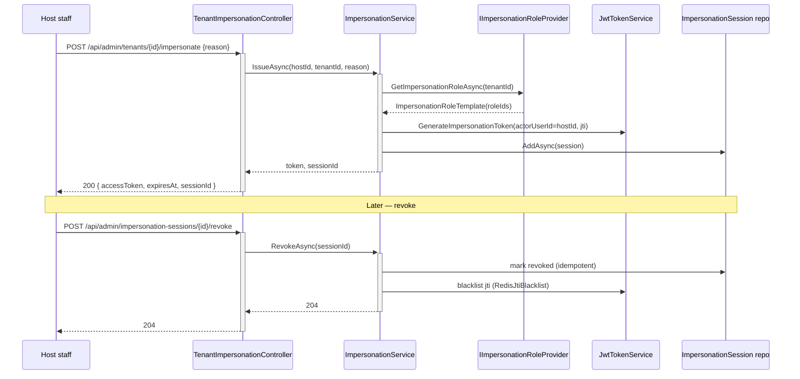

# NAC Framework — System Architecture

## Architectural Overview

NAC Framework is a **layered, modular architecture** for building .NET applications using Domain-Driven Design (DDD) principles. It provides reusable building blocks across three layers (L0, L1, L2+), with each layer adding higher-level abstractions on top of a zero-dependency foundation.

### Design Philosophy

1. **Layered Dependency Graph:** Lower layers never depend on higher layers
2. **Zero-Dependency Foundation (L0):** Maximum reusability
3. **Interface-Based Contracts:** Implementations deferred to higher layers
4. **Convention over Configuration:** Sensible defaults, explicit when needed
5. **Composability:** Modules combine via dependency attributes
6. **Testability:** All abstractions have mockable implementations

---

## Layered Architecture

```
┌─────────────────────────────────────────────────────────────┐
│  Application                                                 │
│  (Consumer projects: AddNacWebApi + AddNacApplication)      │
└─────────────────┬───────────────────────────────────────────┘
                  │
┌─────────────────▼───────────────────────────────────────────┐
│  L3 — WebApi (Composition Root)                             │
│  ├─ Nac.WebApi                                              │
│  │  ├─ NacApplicationFactory (Pre/Config/Post lifecycle)    │
│  │  ├─ NacModuleLoader (Kahn's topo sort)                  │
│  │  ├─ NacApplicationLifetime (IHostedService)             │
│  │  ├─ Middleware pipeline (13 stages)                     │
│  │  ├─ Global exception handling (RFC 9457)                │
│  │  ├─ API versioning (Asp.Versioning)                     │
│  │  ├─ OpenAPI/Swagger                                     │
│  │  ├─ CORS, rate limiting, compression                    │
│  │  └─ Health checks integration                           │
└─────────────────┬───────────────────────────────────────────┘
                  │
      ┌───────────┴───────────────────────────────────────────┐
      │                                                        │
┌─────▼──────────────────────┐    ┌──────────────────────────▼─┐
│ L2 — Feature Layers        │    │ L2 — Feature Layers       │
├────────────────────────────┤    ├──────────────────────────┤
│ Nac.Persistence            │    │ Nac.Identity             │
│ ├─ DbContext               │    │ ├─ Auth integration      │
│ ├─ Entity mappings         │    │ ├─ Permission checker    │
│ ├─ Repository impl         │    │ ├─ Role management       │
│ ├─ Outbox pattern          │    │ └─ Session management    │
│ └─ EF Core interceptors    │    │                          │
└─────┬──────────────────────┘    └──────┬───────────────────┘
      │                                   │
      │ ┌──────────────────────┐         │
      │ │ Nac.MultiTenancy (✅)│         │
      │ │ ├─ Tenant context    │         │
      │ │ ├─ RLS integration   │         │
      │ │ ├─ 4 strategies      │         │
      │ │ └─ Migration support │         │
      │ └──────┬───────────────┘         │
      │        │                         │
      │ ┌──────▼────────────────────────┐│
      │ │ Nac.MultiTenancy.Management (✅)
      │ │ ├─ Tenant aggregate + events  ││
      │ │ ├─ Registry DB (TenantMgmtCtx)││
      │ │ ├─ EfCoreTenantStore (cache)  ││
      │ │ ├─ Encrypted connection str.  ││
      │ │ ├─ 11 REST admin endpoints    ││
      │ │ └─ Outbox-emitted events      ││
      │ └──────┬──────────────────────┘ │
      │        │                         │
      │ ┌──────▼─────────────────┐      │
      │ │ Nac.EventBus (✅)     │      │
      │ │ ├─ Event publishing   │      │
      │ │ ├─ Handler dispatch   │      │
      │ │ ├─ Outbox integration │      │
      │ │ └─ InMemory transport │      │
      │ └──────┬────────────────┘      │
      │        │                        │
      │ ┌──────▼─────────────────┐     │
      │ │ Nac.Observability (✅) │     │
      │ │ ├─ Structured logging  │     │
      │ │ ├─ Diagnostic sources  │     │
      │ │ └─ Logging scope       │     │
      │ └──────┬────────────────┘     │
      │        │                       │
      │ ┌──────▼─────────────────┐    │
      │ │ Nac.Jobs (✅)         │    │
      │ │ ├─ Job scheduling API  │    │
      │ │ ├─ Recurring jobs      │    │
      │ │ └─ Job handler pattern │    │
      │ └──────┬────────────────┘    │
      │        │                      │
      │ ┌──────▼─────────────────┐   │
      │ │ Nac.Testing (✅)      │   │
      │ │ ├─ Test fixtures      │   │
      │ │ ├─ Fluent builders    │   │
      │ │ ├─ 7 in-memory fakes  │   │
      │ │ └─ Assertion helpers  │   │
      │ └────────────────────────┘   │
      │                              │
┌─────┴──────────────────────────────┴──────┐
│                                            │
│  L1 — Higher-Order Abstractions           │
│  ├─ Nac.Cqrs (COMPLETE ✅)                 │
│  │  ├─ Command/Query dispatcher           │
│  │  ├─ Sealed handler pattern             │
│  │  ├─ ValueTask<T> returns               │
│  │  ├─ Pipeline behaviors                 │
│  │  │  ├─ Validation (FluentValidation)   │
│  │  │  ├─ Logging (ILogger)               │
│  │  │  ├─ Caching (INacCache)             │
│  │  │  └─ Transaction (IUnitOfWork)       │
│  │  ├─ ISender dispatch interface         │
│  │  └─ Assembly scanning for handlers     │
│  │                                        │
│  └─ Nac.Caching (COMPLETE ✅)             │
│     ├─ INacCache abstraction              │
│     ├─ HybridCache (.NET 10+) wrapper      │
│     ├─ Tenant-aware key prefixing         │
│     ├─ Tag-based invalidation             │
│     └─ CacheKey static utility            │
└─────┬───────────────────────────────────┘
      │
┌─────▼──────────────────────────────────────┐
│                                             │
│  L0 — Core (Zero Dependencies)             │
│  │                                         │
│  ├─ Primitives                            │
│  │  ├─ Entity<TId>                        │
│  │  ├─ AggregateRoot<TId>                 │
│  │  ├─ ValueObject                        │
│  │  ├─ IDomainEvent                       │
│  │  ├─ IStronglyTypedId                   │
│  │  ├─ IAuditableEntity                   │
│  │  └─ ISoftDeletable                     │
│  │                                         │
│  ├─ Results                               │
│  │  ├─ Result                             │
│  │  ├─ Result<T>                          │
│  │  ├─ ResultStatus                       │
│  │  └─ ValidationError                    │
│  │                                         │
│  ├─ Domain                                │
│  │  ├─ IRepository<T>                     │
│  │  ├─ IReadRepository<T>                 │
│  │  ├─ Specification<T>                   │
│  │  ├─ Guard                              │
│  │  ├─ DomainError                        │
│  │  └─ ITenantEntity                      │
│  │                                         │
│  ├─ Modularity                            │
│  │  ├─ NacModule                          │
│  │  ├─ DependsOnAttribute                 │
│  │  ├─ ServiceConfigurationContext        │
│  │  ├─ ApplicationInitializationContext   │
│  │  └─ ApplicationShutdownContext         │
│  │                                         │
│  ├─ DependencyInjection                   │
│  │  ├─ ITransientDependency               │
│  │  ├─ IScopedDependency                  │
│  │  ├─ ISingletonDependency               │
│  │  └─ DependencyAttribute                │
│  │                                         │
│  ├─ Abstractions                          │
│  │  ├─ Identity (ICurrentUser, etc.)      │
│  │  ├─ Permissions (PermissionDefinition) │
│  │  ├─ Events (IIntegrationEvent)         │
│  │  └─ IDateTimeProvider                  │
│  │                                         │
│  ├─ DataSeeding                           │
│  │  ├─ IDataSeeder                        │
│  │  └─ DataSeedContext                    │
│  │                                         │
│  └─ ValueObjects                          │
│     ├─ Money                              │
│     ├─ Address                            │
│     ├─ DateRange                          │
│     └─ Pagination                         │
│                                            │
└──────────────────────────────────────────┘
```

---

## Core Components Deep Dive

### 1. Primitives Layer (L0)

#### Entity<TId>
**Purpose:** Base class for domain entities (reference types identified by ID)

**Key Features:**
- Type-safe generic ID (TId : notnull)
- Domain event tracking and sourcing
- Protected setter for ID (immutable after creation)
- Event clearing after publication

**Usage:**
```csharp
public class User : Entity<UserId>
{
    public string Email { get; private set; }
    
    public User(UserId id, string email)
    {
        Id = id;
        Email = email;
    }
    
    public void ChangeEmail(string newEmail)
    {
        Email = newEmail;
        RaiseDomainEvent(new UserEmailChangedEvent(Id, newEmail));
    }
}
```

#### AggregateRoot<TId>
**Purpose:** Marks a transactional boundary in the domain

**Key Features:**
- Extends Entity<TId>
- Communicates to persistence layer: "save this unit atomically"
- No additional behavior (semantic marker)

**Usage:**
```csharp
public class Order : AggregateRoot<OrderId>
{
    // Order is the transactional boundary
    // All order-related entities cascade from here
}
```

#### ValueObject
**Purpose:** Immutable, equality-by-value types

**Key Features:**
- Record-based immutability
- Operator overloading (==, !=)
- Hashable (can use in collections)
- No ID; equality determined by property values

**Usage:**
```csharp
public record Money(decimal Amount, string CurrencyCode) : ValueObject
{
    // Equality: two Money objects with same Amount and Currency are equal
    // No ID needed
}
```

#### IDomainEvent
**Purpose:** Marker for in-domain events

**Key Features:**
- Simple interface: `interface IDomainEvent { }`
- Raised on entities, cleared after processing
- Used for event sourcing and audit trails

### 2. Results Layer (L0)

#### Result Pattern
**Purpose:** Explicit error handling without exceptions for business logic

**Key Features:**
- ResultStatus enum: Ok, Invalid, NotFound, Forbidden, Conflict, Error
- Errors: string[] for general errors
- ValidationErrors: field-level validation errors
- Generic Result<T> for payloads

**Result Statuses:**
| Status | Meaning | HTTP | Use Case |
|--------|---------|------|----------|
| Ok | Success | 200 | Operation succeeded |
| Invalid | Validation failed | 400 | Invalid input |
| NotFound | Resource not found | 404 | Entity doesn't exist |
| Forbidden | Access denied | 403 | Permission denied |
| Conflict | State conflict | 409 | Business rule violated |
| Error | Server error | 500 | Unexpected error |

**Usage:**
```csharp
public Result Validate()
{
    if (Age < 18)
        return Result.Invalid(new ValidationError("Age", "Must be 18+"));
    
    return Result.Success();
}

public async Task<Result<User>> GetUserAsync(int id)
{
    var user = await _repository.GetAsync(id);
    if (user is null)
        return Result.NotFound($"User {id} not found");
    
    return Result.Success(user);
}
```

### 3. Domain Layer (L0)

#### Repository Pattern
**Purpose:** Abstract data access for domain entities

**Contracts:**
```csharp
public interface IRepository<T> where T : AggregateRoot<TId>
{
    Task AddAsync(T entity);
    Task UpdateAsync(T entity);
    Task RemoveAsync(T entity);
}

public interface IReadRepository<T> where T : Entity<TId>
{
    Task<T?> GetAsync(TId id);
    Task<IEnumerable<T>> GetAllAsync();
}
```

**Design Decision:** Separate read/write repos prevent accidental mutations on queries

#### Specification Pattern
**Purpose:** Encapsulate reusable query logic with boolean composition

**Features:**
- Composable with And/Or/Not operators
- Type-safe predicate matching
- Can be translated to SQL (via L2 Persistence layer)

**Usage:**
```csharp
// Specifications as building blocks
public class ActiveUserSpec : Specification<User>
{
    public ActiveUserSpec() : base(u => u.IsActive) { }
}

public class PremiumUserSpec : Specification<User>
{
    public PremiumUserSpec() : base(u => u.IsPremium) { }
}

// Compose dynamically
var spec = new ActiveUserSpec() & new PremiumUserSpec();
var results = users.Where(spec.Criteria).ToList();
```

#### Guard
**Purpose:** Declarative input validation

**Common Guards:**
```csharp
Guard.NotNull(value, nameof(value));          // Reference type validation
Guard.NotEmpty(text, nameof(text));           // String validation
Guard.GreaterThanOrEqual(age, 18, nameof(age)); // Numeric bounds
Guard.Length(password, 8, 128, nameof(password)); // String length
```

### 4. Modularity Layer (L0)

#### NacModule
**Purpose:** Define a feature module with automatic DI wiring

**Lifecycle:**
1. **ConfigureServices:** Register dependencies
2. **OnApplicationInitializationAsync:** Start-up logic (seed data, warm caches)
3. **OnApplicationShutdownAsync:** Cleanup

**Example:**
```csharp
[DependsOn(typeof(CoreModule))]
public class UserModule : NacModule
{
    public override void ConfigureServices(ServiceConfigurationContext context)
    {
        context.Services.AddScoped<IUserService, UserService>();
        context.Services.AddScoped<IUserRepository, UserRepository>();
    }

    public override async Task OnApplicationInitializationAsync(ApplicationInitializationContext context)
    {
        // Seed initial users
        var seeder = context.ServiceProvider.GetRequiredService<IDataSeeder>();
        await seeder.SeedAsync();
    }
}
```

#### DependsOn Attribute
**Purpose:** Declare module dependencies (alternative to reflection)

**Example:**
```csharp
[DependsOn(typeof(CoreModule), typeof(PersistenceModule))]
public class ApplicationModule : NacModule { }
```

### 5. Abstractions Layer (L0)

#### Identity Abstractions
**Purpose:** Identity contracts for auth/authorization

```csharp
public interface ICurrentUser
{
    int? Id { get; }
    string? Name { get; }
    bool IsAuthenticated { get; }
    IReadOnlyList<string> Roles { get; }
}

public interface IIdentityService
{
    Task<Result<UserInfo>> AuthenticateAsync(string username, string password);
    Task<Result> RegisterAsync(string username, string email, string password);
}
```

#### Permissions Abstractions
**Purpose:** Declarative permission definitions

```csharp
public class PermissionDefinition
{
    public string Name { get; init; }
    public string DisplayName { get; init; }
    public PermissionGroup? ParentGroup { get; init; }
    public bool IsGrantedByDefault { get; init; }
}

public interface IPermissionChecker
{
    Task<bool> IsGrantedAsync(string permissionName);
}
```

#### Events Abstractions
**Purpose:** Integration event contracts

```csharp
public interface IIntegrationEvent
{
    Guid Id { get; }
    DateTime CreatedAt { get; }
}

// Concrete events
public record UserRegisteredEvent(Guid Id, string Email, string Name) : IIntegrationEvent
{
    public DateTime CreatedAt { get; init; } = DateTime.UtcNow;
}
```

---

## Data Flow Patterns

### 1. Command (Write) Flow

```
API Controller
    ↓
ICommandHandler<TCommand, TResult>
    ↓
[Pipeline Behaviors: Validation, Logging, Authorization]
    ↓
Domain Service / Aggregate Root
    ↓
Guard clauses (validate inputs)
    ↓
Business logic (raise domain events)
    ↓
Repository.UpdateAsync()
    ↓
[EF Core DbContext]
    ↓
Persist entity + events
    ↓
[Event Bus: Publish integration events]
    ↓
Return Result<T>
```

### 2. Query (Read) Flow

```
API Controller
    ↓
IQueryHandler<TQuery, TResult>
    ↓
[Pipeline Behaviors: Caching, Logging]
    ↓
ReadRepository + Specification
    ↓
[EF Core DbContext (no tracking)]
    ↓
Fetch data
    ↓
[Cache if applicable]
    ↓
Map to DTO / ValueObject
    ↓
Return Result<T>
```

### 3. Event Sourcing Flow

```
Aggregate raises domain event
    ↓
Event added to _domainEvents list
    ↓
Entity persisted (Outbox pattern)
    ↓
Domain events stored in Events table
    ↓
Integration events created
    ↓
Event bus publishes to subscribers
    ↓
Handlers update read models, send notifications
    ↓
Domain events cleared from entity
```

---

## Dependency Injection Container Flow

```
NacModule.ConfigureServices()
    ↓
ServiceConfigurationContext.Services.Add*()
    ↓
Convention-based: ITransientDependency, IScopedDependency, ISingletonDependency
    ↓
[L2+ packages] Register implementations
    ↓
ServiceProvider.BuildServiceProvider()
    ↓
DependencyAttribute wiring (if enabled)
    ↓
Modules discovered via [DependsOn]
    ↓
ApplicationInitializationContext.ServiceProvider
    ↓
Modules execute OnApplicationInitializationAsync
```

---

## Cross-Cutting Concerns

### 1. Null Safety
- Nullable reference types enabled globally
- Guard clauses for public API boundaries
- Required properties for immutable types

### 2. Immutability
- ValueObjects are records (immutable)
- AggregateRoots state tracked via entities
- Domain events immutable after raising

### 3. Validation
- Guard clauses for input validation
- Result pattern for business rule violations
- ValidationError for field-level feedback

### 4. Error Handling
- Exceptions: Programming errors (null args, invalid state)
- Result pattern: Business logic failures (validation, not found)
- Domain events: State changes and audit

### 5. Audit Trail
- IAuditableEntity: CreatedAt, CreatedBy, ModifiedAt, ModifiedBy
- Domain events: Who did what, when
- Change logs: L2 Persistence responsibility

---

## Multi-Tenancy Architecture

**Approach:** Tenant context scoped to request

```
HTTP Request (TenantId header)
    ↓
TenantContext.SetTenant(tenantId)
    ↓
DbContext.QueryFilter (RLS)
    ↓
[All queries auto-filtered by TenantId]
    ↓
ITenantEntity interface marks tenant-scoped entities
    ↓
Repository queries filtered automatically
```

---

## Tenant Management Registry Architecture

**Nac.MultiTenancy.Management** adds admin-facing tenant lifecycle management with a centralized registry database separate from application databases.

### Admin Flow (Tenant CRUD)
```
[Admin API Call] POST /api/admin/tenants
    ↓
[Authorization] HostAdminOnlyFilter + "Tenants.Manage" policy
    ↓
[Service] TenantManagementService.CreateAsync()
    ↓
[Aggregate] Tenant.Create() → TenantCreatedEvent
    ↓
[DbContext] TenantManagementDbContext (registry DB)
    ↓
[Encryption] ConnectionString encrypted via DataProtection
    ↓
[Outbox] DomainEventInterceptor → OutboxEvent
    ↓
[Publishing] OutboxWorker processes → IIntegrationEvent published
```

### Runtime Lookup (Tenant Resolution)
```
[Runtime] ITenantStore needed for tenant resolution
    ↓
[Cache] EfCoreTenantStore (10-min sliding window)
    ↓
[Query] TenantManagementDbContext (cache miss)
    ↓
[Return] TenantInfo with encrypted ConnectionString
    ↓
[Decrypt] EncryptedConnectionStringResolver (DataProtection)
    ↓
[Apply] Use plaintext to create per-tenant DbContext
```

### Key Components
- **TenantManagementDbContext:** Host-realm registry (not multi-tenant)
- **Tenant Aggregate:** AggregateRoot<Guid> with audit/soft-delete; emits 5 domain events
- **EfCoreTenantStore:** Caching override with 10-minute invalidation windows
- **EncryptedConnectionStringResolver:** Microsoft.AspNetCore.DataProtection with purpose `Nac.MultiTenancy.Management.ConnectionString`
- **Cache Invalidation:** Explicit per-mutation via ITenantCacheInvalidator

### Security Considerations
- All endpoints require host-admin context (non-null TenantId rejected)
- Authorization policy `"Tenants.Manage"` enforced via claims
- Connection strings encrypted at rest; keys must persist across restarts
- Bulk operations support partial failure (207 Multi-Status responses)

---

## Testing Architecture

### Unit Test Structure
```
[Layer]Tests/
├── [Feature]/
│   └── [Type]Tests.cs
└── Fixtures/
    └── [Feature]Fixture.cs
```

### Test Doubles Strategy
- **Mocks:** Interfaces (IRepository, ICurrentUser)
- **Stubs:** Constants, builders
- **Fakes:** In-memory implementations for integration tests

### Example
```csharp
[Fact]
public void Create_WithValidUser_RaisesDomainEvent()
{
    // Arrange
    var user = new User("john@example.com");
    
    // Act
    user.Confirm();
    
    // Assert
    user.DomainEvents.Should().ContainItemsAssignableTo<UserConfirmedEvent>();
}
```

---

## Performance Considerations

### Lazy Loading
- Queries return IEnumerable<T> (LINQ lazy evaluation)
- Pagination for large result sets
- Projection to DTOs (only needed columns)

### Caching Strategy (L1+)
- Query-level: HybridCache wrapper (L1)
- Result caching: By permission/tenant
- Invalidation: Event-driven

### Batch Operations
- Repository.AddRangeAsync() for bulk inserts
- Bulk update patterns (L2 Persistence)
- Transaction management (L2+)

---

## Deployment Architecture

```
[NuGet Package] Nac.Core v1.0.0
    ↓
[Consumer Project]
├─ References: Nac.Core NuGet
├─ References: Nac.Persistence NuGet
├─ References: Nac.Identity NuGet
└─ References: Nac.WebApi NuGet
    ↓
[Application Startup]
├─ Load Nac.WebApi composition root
├─ Discover modules via [DependsOn]
├─ Wire all DI containers
├─ Initialize application (seed data)
└─ Start Kestrel server
```

---

## Security Architecture

### Input Validation
- Guard clauses at API boundary
- Result pattern for validation errors
- Type-safe strongly-typed IDs

### Authorization
- ICurrentUser abstraction
- IPermissionChecker for permission gates
- Claims-based authorization (L2 Identity)

### Data Protection
- Audit trail (IAuditableEntity)
- Soft delete (ISoftDeletable)
- RLS support (L2 MultiTenancy)
- Encryption at rest (Application responsibility)

---

## 6. EventBus Layer (L2)

### IEventPublisher
**Purpose:** Publish integration events to the bus

**Contract:**
```csharp
public interface IEventPublisher
{
    Task PublishAsync(IIntegrationEvent @event, CancellationToken ct = default);
    Task PublishAsync(IEnumerable<IIntegrationEvent> events, CancellationToken ct = default);
}
```

### IEventHandler<TEvent>
**Purpose:** Handle a specific integration event type

**Contract:**
```csharp
public interface IEventHandler<in TEvent> where TEvent : IIntegrationEvent
{
    Task HandleAsync(TEvent @event, CancellationToken ct = default);
}
```

### IEventDispatcher
**Purpose:** Route events to all registered handlers for that event type

**Dispatch Strategy:** 
- FrozenDictionary<Type, FrozenSet<Type>> registry for O(1) lookup
- Fan-out execution: all handlers invoked (errors logged, not rethrown)
- Assembly scanning for automatic handler discovery

### InMemoryEventBus
**Transport:** System.Threading.Channels (bounded, 1000 capacity)

**Characteristics:**
- Lock-free channel-based publishing
- Background worker (InMemoryEventBusWorker) processes events
- Suitable for single-process deployments
- Fail-safe: one failing handler doesn't block others

### OutboxEventPublisher
**Purpose:** Bridge Persistence Outbox to EventBus

**Role:**
- Implements IIntegrationEventPublisher (from Persistence layer)
- Deserializes outbox payloads (string eventType + JSON)
- Routes to IEventPublisher for in-memory or external transport
- Allowlist-based event type validation

### EventHandlerRegistry
**Features:**
- Assembly scanning via reflection
- Handler discovery: `IEventHandler<T>` implementations
- Multi-handler support (fan-out pattern)
- Thread-safe registration

### Usage Pattern
```csharp
// 1. Publish event (synchronous to bus)
await _eventPublisher.PublishAsync(new UserRegisteredEvent(...));

// 2. Background worker processes asynchronously
// InMemoryEventBusWorker reads from channel

// 3. Dispatcher routes to all handlers
// All UserRegisteredEvent handlers invoked in parallel

// 4. Handlers execute independently
public class SendWelcomeEmailHandler : IEventHandler<UserRegisteredEvent>
{
    public async Task HandleAsync(UserRegisteredEvent @event, CancellationToken ct)
    {
        await _emailService.SendWelcomeAsync(@event.Email, ct);
    }
}
```

---

## 7. Testing Layer (L2)

### Fakes (7 In-Memory Implementations)

**FakeCurrentUser** — ICurrentUser implementation
- Settable Id, Name, IsAuthenticated
- Mutable Roles collection
- No external dependencies

**FakeDateTimeProvider** — IDateTimeProvider implementation
- Settable UtcNow property
- Deterministic time for reproducible tests

**FakePermissionChecker** — IPermissionChecker implementation
- GrantAll() — grant all permissions
- DenyAll() — deny all permissions
- Custom grant/deny lists

**FakeRepository<T>** — IRepository<T> implementation
- In-memory item storage (List<T>)
- Tracks Add/Update/Delete operations
- Supports Specification<T> filtering
- WithItems() fluent seed method

**FakeEventPublisher** — IEventPublisher implementation
- Collects published events (PublishedEvents list)
- No actual dispatch (testing only)

**FakeSender** — ISender implementation (CQRS)
- Collects sent commands/queries (SentRequests list)
- Optional result overrides

**FakeNacCache** — INacCache implementation
- In-memory cache store
- Tag-based invalidation tracking

### Builders

**TestEntityBuilder<TEntity, TBuilder>** — Abstract fluent builder
- Generic entity creation via reflection
- WithProperty(name, value) fluent API
- Customizable CreateEntity() for special construction

**ResultBuilder** — Fluent builder for Result<T>
- Success(value) — create success result
- Failure(status, errors) — create failure result

### Fixtures

**NacTestFixture** — Pre-configured DI container
- All 7 fakes pre-registered
- Override ConfigureServices() to add custom services
- GetService<T>() for dependency retrieval
- Implements IDisposable for cleanup

**InMemoryDbContextFixture<TContext>** — EF Core in-memory DB
- Creates isolated in-memory databases (unique GUID names)
- CreateContext() — factory for fresh DbContext instances
- Suitable for integration tests with same DB state

### Assertion Extensions

**ResultAssertionExtensions** — FluentAssertions integration
- Should().BeSuccess() — assert success status
- Should().BeFailed() — assert failure
- Should().HaveStatus(status) — specific status check
- Error message assertions

### AddNacTesting() Extension
Registers all fakes in IServiceCollection:
```csharp
services.AddNacTesting();
// Automatically registers all fakes with appropriate lifetimes
```

---

## Summary Table

| Concern | L0 | L1 | L2 | L3 |
|---------|----|----|----|----|
| **Primitives** | ✅ | | | |
| **Results** | ✅ | | | |
| **Repositories** | Interfaces ✅ | | Implementations ✅ | |
| **Specifications** | ✅ | | Translation ✅ | |
| **CQRS** | | ✅ COMPLETE | | |
| **Caching** | | ✅ COMPLETE | | |
| **Persistence** | | | ✅ COMPLETE | |
| **Event Bus** | Abstractions ✅ | | ✅ COMPLETE | |
| **Testing** | | | ✅ COMPLETE | |
| **Identity** | Abstractions ✅ | | ✅ COMPLETE | |
| **Multi-Tenancy** | | | ✅ COMPLETE | |
| **Observability** | | | ✅ COMPLETE | |
| **Jobs** | Abstractions ✅ | | ✅ COMPLETE | |
| **Composition** | | | | ✅ COMPLETE |

---

## 8. MultiTenancy Layer (L2)

### ITenantContext
**Purpose:** Access and manage current tenant context within request scope

**Contract:**
```csharp
public interface ITenantContext
{
    TenantInfo? Current { get; }
    string? TenantId => Current?.Id;
    void SetCurrentTenant(TenantInfo? tenant);
}
```

### TenantInfo
**Purpose:** Immutable tenant metadata holder

**Properties:**
- `Id`: Tenant unique identifier
- `Name`: Display name
- `Metadata`: Custom tenant attributes (Dictionary<string, object>)

### ITenantStore
**Purpose:** Persist and retrieve tenant metadata

**Contract:**
```csharp
public interface ITenantStore
{
    Task<TenantInfo?> GetByIdAsync(string tenantId, CancellationToken ct = default);
    Task<IReadOnlyList<TenantInfo>> GetAllAsync(CancellationToken ct = default);
}
```

### Tenant Resolution Strategies (4 Built-In)

**HeaderTenantStrategy** — Extract from HTTP header
```csharp
// Resolves from X-Tenant-Id header (configurable)
// Usage: AddNacMultiTenancy().AddHeaderTenantStrategy("X-Tenant-Id")
```

**ClaimTenantStrategy** — Extract from JWT claim
```csharp
// Resolves from JWT claim (default: "tenant_id")
// Usage: AddNacMultiTenancy().AddClaimTenantStrategy("tenant_id")
```

**RouteTenantStrategy** — Extract from route parameter
```csharp
// Resolves from route parameter (default: "{tenantId}")
// Usage: AddNacMultiTenancy().AddRouteTenantStrategy("tenantId")
```

**SubdomainTenantStrategy** — Extract from subdomain
```csharp
// Resolves from subdomain (e.g., acme.app.com → "acme")
// Usage: AddNacMultiTenancy().AddSubdomainTenantStrategy()
```

### TenantResolutionMiddleware
**Purpose:** Resolve tenant from request and set in ITenantContext

**Processing:**
1. Run registered strategies in order
2. Set ITenantContext.Current on first match
3. Store in HttpContext.Items for downline access
4. Pass to next middleware

### MultiTenantDbContext
**Purpose:** EF Core base with automatic RLS (Row-Level Security) filters

**Features:**
- Auto-adds query filter: `entity.TenantId == context.CurrentTenantId`
- Stacks with soft-delete filters (composable)
- Per-entity opt-in via `HasQueryFilter()`
- Multi-tenancy scoped to IUnitOfWork

**Usage:**
```csharp
public class MyDbContext : MultiTenantDbContext
{
    public DbSet<Customer> Customers { get; set; }
    
    protected override void OnModelCreating(ModelBuilder builder)
    {
        base.OnModelCreating(builder);
        // Auto-filters Customer by TenantId in all queries
    }
}
```

### TenantEntityInterceptor
**Purpose:** EF Core SaveChanges interceptor to auto-set TenantId

**Behavior:**
- Before persisting entity, check ITenantEntity interface
- If `TenantId` is unset, copy from ITenantContext.Current
- Silent no-op if tenant is null (optional validation)

### ITenantConnectionStringResolver
**Purpose:** Per-tenant database isolation

**Contract:**
```csharp
public interface ITenantConnectionStringResolver
{
    string Resolve(string tenantId);
}
```

**Pattern:** Register custom implementation for sharded/isolated DB architectures

### AddNacMultiTenancy() Extension
**Registers:**
- ITenantContext (scoped)
- ITenantStore (InMemory by default; override for persistence)
- Strategy resolvers (chain pattern)
- TenantResolutionMiddleware
- TenantEntityInterceptor
- NacMultiTenancyModule

---

## 9. Identity Layer (L2) — Pattern A (v3)

> Full spec: **[docs/identity-and-rbac.md](identity-and-rbac.md)** — this section is a summary.

### Shape at a glance

- **Portable user.** `NacUser` is global — no `TenantId`.
- **Tenant membership.** `UserTenantMembership` (M:N) mediates tenant access; holds `Status` (`Invited|Active|Suspended|Removed`), `IsDefault`.
- **Tenant-scoped roles.** `NacRole.TenantId` nullable (null = system template); `MembershipRole` join assigns roles per membership.
- **ABP-style grants.** Single `PermissionGrant(ProviderName, ProviderKey, PermissionName, TenantId?)` table. Providers: `U` (user-direct), `R` (role).
- **Minimal JWT.** `sub, email, name?, tenant_id?, role_ids?, is_host?`. No permission claims.
- **Runtime resolution.** `IPermissionChecker` unions user-direct + role grants via `IPermissionGrantCache` (10min TTL, invalidation-first).
- **Role templates.** `IRoleTemplateProvider` + `RoleTemplateSeeder` seeds `owner`, `admin`, `member`, `guest` as `IsTemplate=true, TenantId=null`. Clone-on-onboarding produces tenant-scoped roles.

### Key Services

| Service | Purpose |
|---|---|
| `JwtTokenService` (concrete) | Pure token generation — no DB reads. Minimal claims. No `IJwtTokenService` interface in v3. |
| `IPermissionChecker` | Current-user / cross-user / cross-tenant checks. Resource-aware overload stubbed for v4. |
| `IPermissionGrantCache` | `IDistributedCache` wrapper with pattern invalidation. |
| `IMembershipService` | Invite / Accept / ChangeRoles / List memberships. Invalidates user cache on role change. |
| `IRoleService` | CRUD + grant/revoke + CloneFromTemplate. |
| `ITenantSwitchService` | Active-membership validation + tenant-scoped JWT re-issue. |

### Host User Gate

Two required conditions: `NacUser.IsHost == true` **and** `Host.AccessAllTenants` permission grant. Enforced by `HostAdminOnlyFilter` (management endpoints) and `AsHostQueryAsync<T>` (cross-tenant queries — bypasses `ITenantEntity` filter only after both checks pass).

### Auth Endpoints (`MapNacAuthEndpoints`)

`POST /auth/login` · `POST /auth/switch-tenant` · `POST /auth/refresh` (501 stub) · `POST /auth/logout` · `GET /auth/me` · `GET /auth/memberships` · `POST /auth/accept-invitation`. `[AllowTenantless]` on tenantless endpoints; `TenantRequiredGateMiddleware` 403s tenant-scoped endpoints when `tenant_id` is absent.

### Admin Surface (`Nac.Identity.Management`)

Controllers under `/api/identity/*`: `users`, `users/{id}/grants`, `roles`, `role-templates`, `memberships`, `permissions`, `onboarding`. Registered via `AddNacIdentityManagement()`. Tenant-onboarding handler subscribes to `TenantCreatedEvent` and clones templates for the new tenant.

### DI Registration

```csharp
services.AddNacIdentity<AppDbContext>(opts => {
    opts.JwtIssuer     = "my-app";
    opts.JwtAudience   = "nac-staff";
    opts.JwtSigningKey = config["Jwt:Key"]!;
});
services.AddNacIdentityManagement();   // admin HTTP surface
services.AddSingleton<IImpersonationRoleProvider, MyImpersonationRoleProvider>(); // required for impersonation
// AddNacRoleTemplates() is called inside AddNacIdentity<T>.

app.MapNacAuthEndpoints();
app.UseNacAuthGate();                  // TenantRequiredGateMiddleware
```

### Host Impersonation for Support (v3.1)

Short-lived tenant-scoped JWT + `ImpersonationSession` audit row. Host staff with `Host.ImpersonateTenant` get a 15-minute non-renewable token carrying RFC 8693 `act.sub = <hostId>`; `is_host` claim is forced absent; tenant is pinned. All mutations during the session stamp `UpdatedBy` (tenant persona = host user id) and `ImpersonatorId` (host user id) via `AuditableEntityInterceptor`. Outbox envelope carries `ActorUserId` + `ImpersonatorUserId`. JTI revocation via Redis blacklist (fail-closed on cache error). Rate limit 10 tokens / 5 min per host user (atomic Redis INCR). Nested impersonation rejected. See `docs/identity-and-rbac.md` §9 for full spec.



---

## 10. Observability Layer (L2)

### LoggingEnricherMiddleware
**Purpose:** Enrich HTTP request context with structured logging fields

**Features:**
- Automatic extraction of request/response metadata
- TraceId and SpanId injection for distributed tracing
- User identification (from ICurrentUser)
- Tenant context (from ITenantContext)
- Performance timing (elapsed milliseconds)

**Integration:** Middleware pipeline (AddNacObservability extension)

### Diagnostic Constants
**Purpose:** Centralized ActivitySource and Meter names

**NacActivitySources**
- Defines activity source names for OpenTelemetry integration
- Enables cross-process tracing

**NacMeters**
- Defines meter names for metrics collection
- Structured naming for Prometheus/OpenTelemetry export

### NacLoggingScope Extension
**Purpose:** Fluent API for scoped logging context

**Usage:**
```csharp
using var scope = NacLoggingScope.Create()
    .WithUserId(userId)
    .WithTenantId(tenantId)
    .WithCustomField("operationId", operationId);

// All logs within scope include context fields
```

### AddNacObservability() Extension
**Registers:**
- LoggingEnricherMiddleware
- Serilog integration (if configured)
- OpenTelemetry activity sources
- NacObservabilityModule

---

## 11. Jobs Layer (L2)

### IJobScheduler
**Purpose:** Schedule one-time and delayed jobs

**Contract:**
```csharp
public interface IJobScheduler
{
    Task<string> EnqueueAsync<TJob>(CancellationToken ct = default) 
        where TJob : IJobHandler;
    
    Task<string> ScheduleAsync<TJob>(TimeSpan delay, CancellationToken ct = default) 
        where TJob : IJobHandler;
}
```

### IRecurringJobManager
**Purpose:** Register and manage recurring job schedules

**Contract:**
```csharp
public interface IRecurringJobManager
{
    Task AddOrUpdateAsync<TJob>(string jobId, string cronExpression, CancellationToken ct = default) 
        where TJob : IJobHandler;
    
    Task RemoveAsync(string jobId, CancellationToken ct = default);
}
```

### IJobHandler<TJob>
**Purpose:** Define job business logic

**Contract:**
```csharp
public interface IJobHandler<TJob> where TJob : JobDefinition
{
    Task ExecuteAsync(TJob job, CancellationToken ct = default);
}
```

### JobDefinition
**Purpose:** Immutable job metadata

**Properties:**
- `Id`: Unique job identifier
- `Type`: Job class name
- `Parameters`: Dictionary<string, object> for job arguments
- `ScheduledAt`: Execution time
- `RetryCount`: Number of retries allowed

### FakeJobScheduler
**Purpose:** Testing implementation of IJobScheduler

**Features:**
- Collects scheduled jobs (ScheduledJobs list)
- No actual scheduling
- Useful for unit tests

### FakeRecurringJobManager
**Purpose:** Testing implementation of IRecurringJobManager

**Features:**
- Collects registered recurring jobs
- Tracks add/update/remove operations
- Useful for configuration tests

### AddNacJobs() Extension
**Registers:**
- IJobScheduler (configurable implementations)
- IRecurringJobManager (configurable implementations)
- FakeJobScheduler and FakeRecurringJobManager (for testing)
- NacJobsModule

---

## 12. WebApi Layer (L3 Composition Root)

### Module System Architecture

#### NacModule
**Purpose:** Base class for all modules with lifecycle hooks

**Lifecycle (3 Phases):**
1. **PreConfigureServices:** Pre-setup phase (optional override)
2. **ConfigureServices:** Main service registration phase
3. **PostConfigureServices:** Post-setup phase (optional override)

#### DependsOnAttribute
**Purpose:** Declarative module dependency declaration

**Example:**
```csharp
[DependsOn(typeof(NacCoreModule))]
[DependsOn(typeof(NacIdentityModule))]
public sealed class NacWebApiModule : NacModule { }
```

#### NacModuleLoader
**Purpose:** Discover and topologically sort modules via Kahn's algorithm

**Algorithm:**
1. **Discovery:** Walk DependsOn graph via BFS from startup module
2. **Cycle Detection:** Detect if any circular dependencies exist
3. **Topological Sort:** Order modules so dependencies come before dependents
4. **Instantiation:** Create module instances in sorted order

**Throws:** InvalidOperationException if circular dependency detected

**Usage:**
```csharp
var modules = NacModuleLoader.LoadModules<AppModule>();
// Result: [NacCoreModule, NacObservabilityModule, NacWebApiModule, AppModule]
// Dependencies always before dependents
```

#### NacApplicationFactory
**Purpose:** Orchestrate module lifecycle setup

**Three-Phase Execution:**
```
1. PreConfigureServices()  ← All modules
2. ConfigureServices()     ← All modules (service registration)
3. PostConfigureServices() ← All modules
```

**Usage:**
```csharp
var factory = NacApplicationFactory.Create(
    typeof(AppModule),
    services,
    configuration);

// factory.Modules = ordered module list
```

#### NacApplicationLifetime
**Purpose:** IHostedService for application initialization and shutdown

**Lifecycle:**
- **StartAsync:** Calls ApplicationInitializationAsync on all modules
- **StopAsync:** Calls ApplicationShutdownAsync on all modules

### WebApi Composition

#### NacWebApiOptions
**Configuration Toggles:**
- `EnableApiVersioning` (default: true) — Asp.Versioning integration
- `EnableOpenApi` (default: true) — OpenAPI/Swagger endpoint
- `EnableCors` (default: true) — CORS middleware
- `EnableRateLimiting` (default: false) — Rate limiting middleware
- `EnableResponseCompression` (default: true) — Brotli + Gzip
- `EnableHealthChecks` (default: true) — /healthz endpoint
- `ConfigureApiVersioning` — Optional callback
- `ConfigureCors` — Optional callback
- `ConfigureRateLimiter` — Optional callback

#### NacExceptionHandler
**Purpose:** Global exception handling with RFC 9457 ProblemDetails

**Catches:**
- All unhandled exceptions
- Maps to ProblemDetails response
- Sets HTTP status code based on exception type

#### ResultToHttpMapper
**Purpose:** Map Result<T> status to HTTP response code

**Mapping (6 statuses):**
| ResultStatus | HTTP | Description |
|---|---|---|
| Ok | 200 | Success |
| Invalid | 400 | Validation error |
| NotFound | 404 | Resource not found |
| Forbidden | 403 | Access denied |
| Conflict | 409 | Business rule conflict |
| Error | 500 | Server error |

#### Middleware Pipeline (UseNacApplication)

**13-Stage Ordered Pipeline:**
```
1. ExceptionHandler       [Always] - Global error handling
2. HTTPS Redirection      [Always] - Force HTTPS
3. Response Compression   [Conditional] - Brotli/Gzip
4. Routing                [Always] - Route resolution
5. Rate Limiter           [Conditional] - Request throttling
6. CORS                   [Conditional] - Cross-origin
7. MultiTenancy           [Conditional] - If NacMultiTenancyModule in DependsOn
8. Authentication         [Always] - JWT/OAuth (no-op if unconfigured)
9. Authorization          [Always] - Permission checks
10. Observability         [Conditional] - If NacObservabilityModule in DependsOn
11. Controllers           [Always] - Route to controller actions
12. OpenAPI               [Conditional] - /openapi endpoint
13. Health Checks         [Conditional] - /healthz endpoint
```

**Conditional Inclusion:**
```csharp
// Only included if module is in DependsOn graph
if (HasModule<NacMultiTenancyModule>(factory))
    app.UseNacMultiTenancy();
if (HasModule<NacObservabilityModule>(factory))
    app.UseNacObservability();
```

### Consumer API (4-Line Integration)

**Program.cs:**
```csharp
var builder = WebApplication.CreateBuilder(args);

// 1. Configure WebApi options
builder.Services.AddNacWebApi(opts =>
{
    opts.EnableApiVersioning = true;
    opts.EnableOpenApi = true;
    opts.EnableCors = true;
    opts.EnableRateLimiting = false;
    opts.EnableResponseCompression = true;
    opts.EnableHealthChecks = true;
});

// 2. Add application module (which DependsOn required packages)
builder.Services.AddNacApplication<AppModule>(builder.Configuration);

// 3. Build and use application
var app = builder.Build();
app.UseNacApplication();
app.Run();
```

Where `AppModule`:
```csharp
[DependsOn(typeof(NacWebApiModule))]
[DependsOn(typeof(NacIdentityModule))]
[DependsOn(typeof(NacMultiTenancyModule))]
public class AppModule : NacModule
{
    public override void ConfigureServices(ServiceConfigurationContext context)
    {
        // Consumer's application-specific services
    }
}
```

### Integration Patterns

**Services Automatically Wired:**
- All NacModule instances registered in DI
- NacModuleLoader output stored in NacApplicationFactory
- NacApplicationFactory registered as singleton
- NacApplicationLifetime registered as IHostedService

**Exception Handler Flow:**
```
Unhandled Exception
    ↓
NacExceptionHandler catches
    ↓
Maps to ProblemDetails (RFC 9457)
    ↓
Sets HTTP status via ResultToHttpMapper
    ↓
Returns JSON response
```

---

## Consumer Blueprint

**Reference Implementation:** `samples/ReferenceApp/` — Canonical consumer project blueprint demonstrating Orders + Billing modules with cross-module integration event flow, multi-tenancy, JWT authorization, and integration tests. Points `ConnectionStrings:Default` at an external user-managed Postgres 17 instance (no docker-compose bundled). Copy-rename as a starter template (replaces `dotnet new` in v1).

Key patterns demonstrated:
- Per-module DbContext with schema isolation
- Outbox pattern for reliable event publication
- Cross-module event handlers with tenant propagation
- Permission-based authorization with dynamic policy provider
- Multi-schema migrations per module

---

**Last Updated:** 2026-04-17 (Wave 3 + Consumer Reference Architecture)
**Target Framework:** .NET 10.0 LTS  
**Architecture Pattern:** Layered + DDD + Modular Monolith
