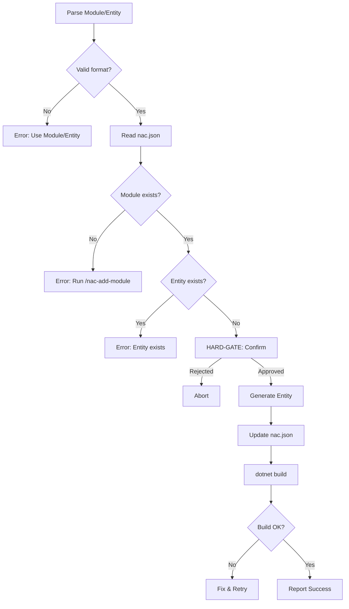

# Add Entity

## Prerequisites

- `nac.json` with module registered
- Module exists from `/nac-add-module`

## Arguments

| Arg | Required | Description |
|-----|----------|-------------|
| `<Module>/<EntityName>` | Yes | e.g., `Catalog/Product` |

## Workflow



## Steps

### 1. Parse Input
- Format: `Module/Entity` (e.g., `Catalog/Product`)
- Both must be PascalCase

### 2. Read nac.json
- Extract `namespace`
- Verify module in `modules`

### 3. Validate
- Module path: `src/Modules/{Namespace}.Modules.{Module}/`
- Infrastructure path: from nac.json `infrastructurePath` or derive as `{modulePath}.Infrastructure`
- Entity not exists: `Domain/Entities/{Entity}.cs`

### 4. HARD-GATE: Confirm
```
AskUserQuestion: "Create entity '{Entity}' in '{Module}'?
- Domain/Entities/{Entity}.cs (module core)
- Configurations/{Entity}Configuration.cs (module infrastructure)
- Inherits AggregateRoot<Guid>
Proceed?"
```

### 5. Generate Entity
- Load `references/entity-templates.md`
- Create `Domain/Entities/{Entity}.cs` in module core project
- Create `Configurations/{Entity}Configuration.cs` in module `.Infrastructure` project
- If `.Infrastructure` project doesn't exist, warn user to run `/nac-add-module` first

### 6. Update nac.json
- Add entity to module's `entities` array

### 7. Verify
```bash
dotnet build
```

## Error Recovery

| Error | Resolution |
|-------|------------|
| Module not found | Run `/nac-add-module` first |
| Entity exists | Choose different name |
| Invalid format | Use `Module/Entity` format |
