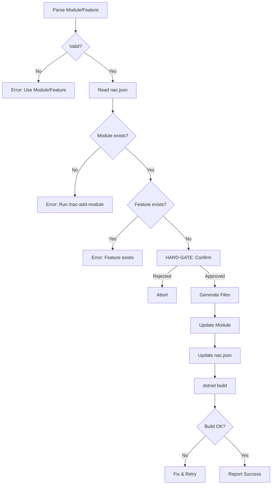

# Add CQRS Feature

Creates Command + Handler + Endpoint for a module.

## Prerequisites

- `nac.json` with module registered
- Module exists from `/nac-add-module`

## Arguments

| Arg | Required | Description |
|-----|----------|-------------|
| `<Module>/<FeatureName>` | Yes | e.g., `Catalog/CreateProduct` |

## Workflow



## Steps

### 1. Parse Input
- Format: `Module/Feature` (e.g., `Catalog/CreateProduct`)
- Both must be PascalCase

### 2. Read nac.json
- Extract `namespace`
- Verify module in `modules`

### 3. Validate
- Module path exists
- Feature not exists (check Command file)

### 4. HARD-GATE: Confirm
```
AskUserQuestion: "Create feature '{Feature}' in '{Module}'?
- Application/Commands/{Feature}Command.cs
- Application/Commands/{Feature}Handler.cs
- Endpoints/{Feature}Endpoint.cs
- Update {Module}Module.cs
Proceed?"
```

### 5. Generate Files
- Load `references/cqrs-templates.md`
- Create Command, Handler, Endpoint

### 6. Update Module
- Add endpoint mapping in {Module}Module.cs
- Add feature to nac.json `features` array

### 7. Verify
```bash
dotnet build
```

## Error Recovery

| Error | Resolution |
|-------|------------|
| Module not found | Run `/nac-add-module` first |
| Feature exists | Choose different name |
| Build fails | Check imports, namespace |
