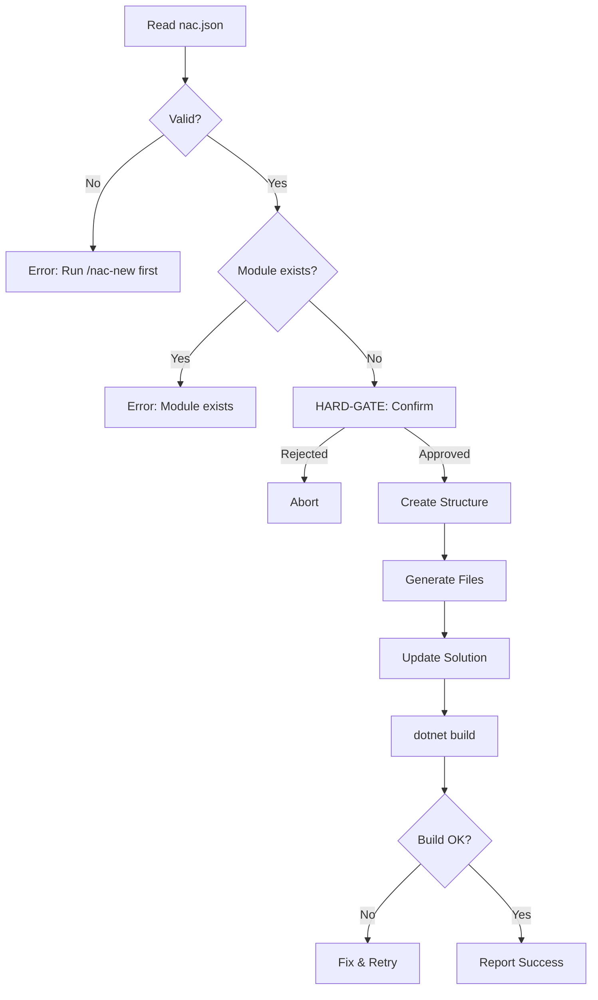

# Add NAC Module

## Prerequisites

- `nac.json` exists in project root
- Solution structure from `/nac-new`

## Arguments

| Arg | Required | Description |
|-----|----------|-------------|
| `<ModuleName>` | Yes | PascalCase module name (e.g., Catalog, Orders) |

## Workflow



## Steps

### 1. Read nac.json
Extract: `namespace`, `modules`, `localNacPath` (if present)

### 2. Validate
- Module name: PascalCase, alphanumeric
- Module not in `modules` already

### 3. HARD-GATE: Confirm
```
AskUserQuestion: "Add module '{Module}'?
- src/Modules/{Namespace}.Modules.{Module}/
- Domain/, Application/, Infrastructure/, Endpoints/
- Update Program.cs to register module
Proceed?"
```

### 4. Create Structure
```
src/Modules/{Namespace}.Modules.{Module}/
├── {Namespace}.Modules.{Module}.csproj
├── {Module}Module.cs
├── Domain/
│   ├── Entities/
│   ├── Events/
│   └── Specifications/
├── Application/
│   ├── Commands/
│   ├── Queries/
│   └── EventHandlers/
├── Infrastructure/
│   ├── Persistence/
│   └── Repositories/
└── Endpoints/
```

### 5. Generate Files
- Load `references/module-templates.md`
- Create .csproj (Package or Project reference based on `localNacPath`)
- Create {Module}Module.cs

### 6. Update Solution
1. Add project to .slnx under `/src/Modules/`
2. Add module to nac.json `modules`
3. Add reference to Host.csproj
4. Add `.AddModule<{Module}Module>()` to Program.cs

### 7. Verify
```bash
dotnet build
```

## Error Recovery

| Error | Resolution |
|-------|------------|
| nac.json missing | Run `/nac-new` first |
| Module exists | Choose different name |
| Build fails | Check package references |
