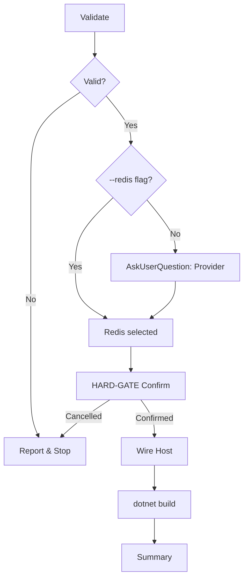

# Nac.Caching Installation Skill

**Load:** `references/wiring-patterns.md` before starting.

## Workflow



---

## Step 1: Validate

Read `nac.json` → extract `namespace`. Confirm `src/{Namespace}.Host/` exists.
Check `AddNacCaching` not already in `Program.cs` — if found, stop (already wired).

```bash
cat nac.json | jq '.namespace'
grep -r "AddNacCaching" src/*/Program.cs
```

## Step 2: Provider Selection

Skip if `--redis` flag provided. Otherwise use `AskUserQuestion`:
- "In-memory (default)" — no extra dependencies
- "Redis" — requires StackExchangeRedis + connection string

## Step 3: HARD-GATE Confirmation

<HARD-GATE>
MUST use AskUserQuestion before modifying any files. NEVER skip.
</HARD-GATE>

Show files to be modified: `{Namespace}.Host.csproj`, `Program.cs`, `appsettings.json` (Redis only).
Options: "Yes, apply changes" / "No, cancel"

## Step 4: Wire Host

Follow exact templates from `references/wiring-patterns.md`.

1. **Directory.Packages.props** — add `<PackageVersion>` for `Nac.Caching` (if PackageReference mode); add `Microsoft.Extensions.Caching.StackExchangeRedis` if Redis chosen. Skip Nac entries if `localNacPath` in `nac.json`
2. **Host.csproj** — add `PackageReference` (or `ProjectReference` if `localNacPath`); add Redis ref if chosen. No `Version=` attribute
3. **Program.cs** — add `using Nac.Caching.Extensions;`; if Redis add `AddStackExchangeRedisCache()` before; add `AddNacCaching()`
4. **appsettings.json** (Redis only) — add `"Redis": "localhost:6379"` under `ConnectionStrings`

## Step 5: Build & Summary

```bash
dotnet build src/{Namespace}.Host
```

On success report modified files and point to `references/wiring-patterns.md` for `ICacheable` / `ICacheInvalidator` usage examples.

---

## Arguments

| Argument  | Description                              |
|-----------|------------------------------------------|
| `--redis` | Skip provider prompt, use Redis directly |

## Error Recovery

| Error                          | Resolution                                            |
|--------------------------------|-------------------------------------------------------|
| `nac.json` not found           | Run `/nac-new` first                                  |
| Host directory not found       | Verify `namespace` in `nac.json` matches folder name  |
| `AddNacCaching` already exists | Already wired — no action needed                      |
| Redis NuGet restore fails      | Check network; run `dotnet restore` manually          |
| Build fails after wiring       | Confirm `Nac.Caching.csproj` path in ProjectReference |
