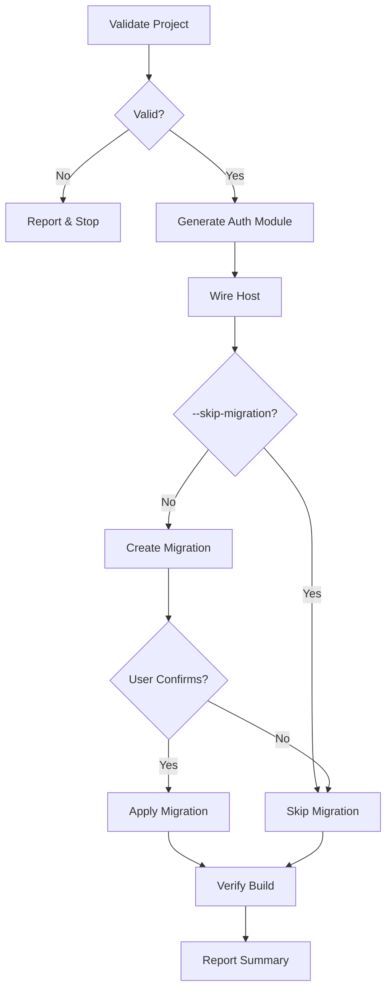

# Nac.Identity Implementation Skill

Guided workflow to add authentication and multi-tenancy to NAC-based projects.

## Workflow



## Prerequisites

- NAC project with `nac.json`
- PostgreSQL database configured
- Connection string in `appsettings.json`

---

## Step 1: Validate Project

1. Read `nac.json` - extract `namespace` and `modules` list
2. Check `src/{Namespace}.Host/` exists
3. Verify `appsettings.json` has `ConnectionStrings` section
4. Check if `Nac.Identity` package referenced

**If validation fails:** Report missing items, stop workflow.

```bash
# Quick validation commands
cat nac.json | jq '.namespace, .modules'
ls src/*/appsettings.json
grep -r "Nac.Identity" src/*/*.csproj
```

---

## Step 2: Generate Auth Module

Create module structure:

```
src/Modules/{Namespace}.Auth/
├── {Namespace}.Auth.csproj
├── DTOs/
│   ├── LoginRequest.cs
│   ├── RegisterRequest.cs
│   ├── RefreshRequest.cs
│   ├── ChangePasswordRequest.cs
│   ├── ForgotPasswordRequest.cs
│   ├── SelectTenantRequest.cs
│   ├── TokenResponse.cs
│   └── TenantListResponse.cs
└── Endpoints/
    └── AuthEndpoints.cs
```

**Load:** `references/auth-endpoints.md` for complete code patterns.

### Generation Steps

1. Create directories: `mkdir -p src/Modules/{Namespace}.Auth/{DTOs,Endpoints}`
2. Create `.csproj` with `Nac.Identity` reference
3. Create all 8 DTO files
4. Create `AuthEndpoints.cs` with all endpoint implementations
5. Update `nac.json` to register module

---

## Step 3: Wire Host Integration

### Update Program.cs

Add these lines in order:

```csharp
// After builder creation
using Nac.Identity.Extensions;

// In service configuration
var connectionString = builder.Configuration.GetConnectionString("DefaultConnection");
builder.Services.AddNacIdentity(builder.Configuration, db => db.UseNpgsql(connectionString));

// After app creation, before UseRouting
app.UseNacIdentity(seedRoles: true);

// Map auth endpoints
app.MapAuthEndpoints();
```

### Update appsettings.json

Add `NacIdentity` section:

```json
{
  "NacIdentity": {
    "SigningKey": "your-signing-key-min-32-chars-here-change-in-production",
    "Issuer": "{Namespace}",
    "Audience": "{Namespace}",
    "AccessTokenExpiry": "00:15:00",
    "RefreshTokenExpiry": "7.00:00:00"
  }
}
```

### Update Directory.Packages.props (if new packages)

1. Read `Directory.Packages.props` from solution root
2. Add `<PackageVersion>` entries if not already present:

```xml
<PackageVersion Include="Nac.Identity" Version="{NacVersion}" />
<PackageVersion Include="Npgsql.EntityFrameworkCore.PostgreSQL" Version="10.0.2" />
```

3. If `localNacPath` in `nac.json`: skip `Nac.Identity` PackageVersion (uses ProjectReference instead), still add `Npgsql` entry

### Add Package Reference to Host.csproj (if missing)

```xml
<PackageReference Include="Nac.Identity" />
<PackageReference Include="Npgsql.EntityFrameworkCore.PostgreSQL" />
```

---

## Step 4: Create Migration

<HARD-GATE>
MUST use AskUserQuestion before applying migration.
NEVER skip confirmation.
NEVER auto-apply migrations.
</HARD-GATE>

**If `--skip-migration` flag provided:** Skip to Step 5.

**Load:** `references/migration-safety.md` for confirmation protocol.

### Migration Commands

```bash
# Create migration
dotnet ef migrations add InitialIdentity \
  -p src/Nac.Identity \
  -s src/{Namespace}.Host

# Generate SQL preview
dotnet ef migrations script \
  -p src/Nac.Identity \
  -s src/{Namespace}.Host \
  --idempotent
```

### Confirmation Flow

1. Generate SQL preview
2. Show tables that will be created:
   - `AspNetUsers`
   - `AspNetRoles`
   - `AspNetUserRoles`
   - `TenantRoles`
   - `TenantMemberships`
   - `RefreshTokens`
3. Use `AskUserQuestion` with options:
   - "Yes, apply migration"
   - "No, skip for now"

### Apply or Skip

**If confirmed:**
```bash
dotnet ef database update \
  -p src/Nac.Identity \
  -s src/{Namespace}.Host
```

**If skipped:**
Inform user: "Migration files created. Run manually when ready:
`dotnet ef database update -p src/Nac.Identity -s src/{Namespace}.Host`"

---

## Step 5: Verify

1. Run `dotnet build src/{Namespace}.Host`
2. Report any errors
3. Summarize created items:
   - Auth module with 8 endpoints
   - Host integration
   - Database tables (if migration applied)

### Success Output

```
✓ Nac.Identity implemented successfully

Created:
- src/Modules/{Namespace}.Auth/ (8 DTOs, AuthEndpoints.cs)
- Host integration (Program.cs, appsettings.json)
- Database tables: 6 tables (if migration applied)

Endpoints available:
- POST /auth/login
- POST /auth/register
- GET  /auth/tenants
- POST /auth/select-tenant
- POST /auth/refresh
- POST /auth/logout
- POST /auth/change-password
- POST /auth/forgot-password

Next steps:
1. Start host: dotnet run --project src/{Namespace}.Host
2. Test login: curl -X POST http://localhost:5000/auth/register -H "Content-Type: application/json" -d '{"email":"test@example.com","password":"Test123!"}'
```

---

## Multi-Tenancy Options

**Load:** `references/tenant-flows.md` for detailed patterns.

| Flow | Use Case | Configuration |
|------|----------|---------------|
| 2-Step Login | Admin panels | Default (no extra config) |
| Domain-Based | Public sites | Add `AddNacMultiTenancy()` |
| Hybrid | Both | Route-based configuration |

---

## Arguments

| Argument | Description |
|----------|-------------|
| `--skip-migration` | Generate code only, skip database migration step |

---

## Error Recovery

| Error | Resolution |
|-------|------------|
| `nac.json` not found | Run `/nac-new` first |
| Connection string missing | Add to `appsettings.json` |
| EF tools not installed | `dotnet tool install -g dotnet-ef` |
| Migration fails | Check `references/migration-safety.md` for rollback |
