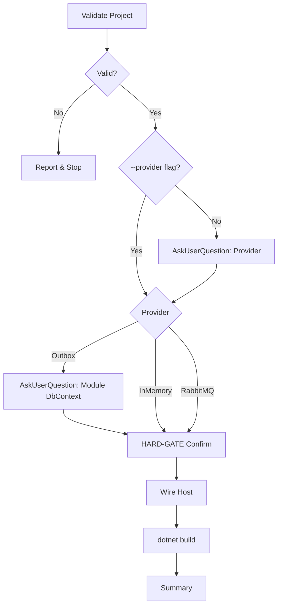

# Nac.Messaging Installation Skill

Guided workflow to add integration event messaging to NAC-based projects.

## Workflow



**Load:** `references/wiring-patterns.md` for all code templates.

---

## Step 1: Validate

1. Read `nac.json` → extract `namespace`, `hostProject`, `modules`
2. Confirm `src/{hostProject}/` exists
3. Check `Program.cs` — if `AddNacInMemoryMessaging`, `AddNacOutboxMessaging`, or `AddNacRabbitMQ` found: report active provider and stop

```bash
cat nac.json | jq '.namespace, .hostProject, .modules'
grep -r "AddNac.*Messaging\|AddNacRabbitMQ" src/
```

---

## Step 2: Provider Selection

**If `--provider` flag given:** skip `AskUserQuestion`.

**Otherwise** ask via `AskUserQuestion`:
- **InMemory** — channel-based, single-process (dev/test)
- **Outbox** — transactional, same-tx DB writes (production recommended)
- **RabbitMQ** — distributed, cross-process

**If Outbox selected:** ask via `AskUserQuestion` which module's `DbContext` to use (scan `nac.json` modules for choices).

---

## Step 3: HARD-GATE Confirmation

<HARD-GATE>
MUST use AskUserQuestion before modifying any file.
Show exact files: Host.csproj, Program.cs, appsettings.json (RabbitMQ only).
NEVER skip confirmation.
</HARD-GATE>

---

## Step 4: Wire Host

1. **Directory.Packages.props** — add `<PackageVersion>` entries for `Nac.Messaging` (and `Nac.Messaging.RabbitMQ` if RabbitMQ chosen). Skip if `localNacPath` in `nac.json` (uses ProjectReference instead)
2. **Host.csproj** — add references (PackageReference or ProjectReference based on mode). No `Version=` attribute
3. **Program.cs** — add `using` + DI call:

| Provider | Ref(s) | Namespace(s) | DI Call |
|----------|--------|--------------|---------|
| InMemory | `Nac.Messaging` | `Nac.Messaging.Extensions` | `AddNacInMemoryMessaging(assemblies)` |
| Outbox | `Nac.Messaging` | `Nac.Messaging.Extensions` | `AddNacOutboxMessaging<{Module}DbContext>(assemblies)` |
| RabbitMQ | `Nac.Messaging` + `Nac.Messaging.RabbitMQ` | both Extensions namespaces | `AddNacRabbitMQ(options, assemblies)` |

**RabbitMQ only:** add `RabbitMq` section to `appsettings.json` — see `references/wiring-patterns.md`.

---

## Step 5: Build & Summary

```bash
dotnet build src/{hostProject}/{hostProject}.csproj
```

Report provider, files changed, then next steps:
1. Define: `public sealed record MyEvent : IntegrationEvent { ... }`
2. Publish: `await _eventBus.PublishAsync(new MyEvent { ... }, ct);`
3. Handle: implement `IIntegrationEventHandler<MyEvent>`
4. Outbox: run `dotnet ef database update` to create `OutboxMessages` table

---

## Error Recovery

| Error | Resolution |
|-------|------------|
| `nac.json` not found | Run `/nac-new` first |
| Already wired | Remove existing call or add assemblies manually |
| Outbox: missing `OutboxMessages` table | Run `dotnet ef database update` for module DbContext |
| RabbitMQ build error | Ensure both `Nac.Messaging` + `Nac.Messaging.RabbitMQ` refs present |
| RabbitMQ connection refused | Check `appsettings.json` RabbitMq section, verify broker running |
