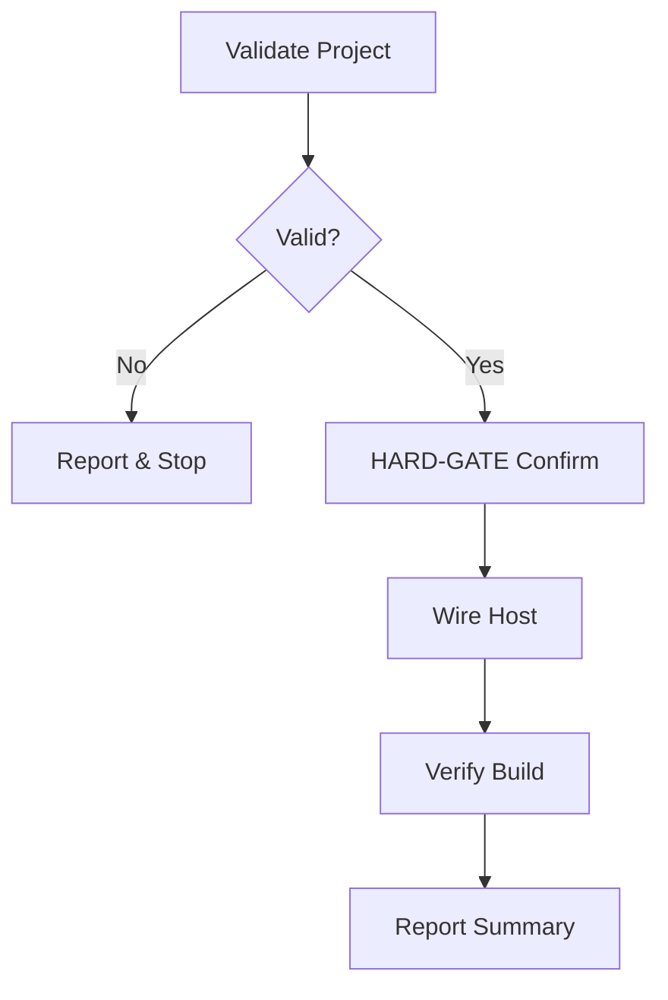

# Nac.Observability Implementation Skill

Guided workflow to add structured logging and timing to the CQRS pipeline.

## Workflow



---

## Step 1: Validate

1. Read `nac.json` — extract `namespace`
2. Confirm `src/{Namespace}.Host/` exists
3. Check `Program.cs` — if `AddNacObservability` already present, report and stop

```bash
cat nac.json | jq '.namespace'
grep -r "AddNacObservability" src/*/*.cs
```

---

## Step 2: HARD-GATE Confirmation

<HARD-GATE>
MUST use AskUserQuestion before modifying any files.
NEVER skip confirmation.
</HARD-GATE>

Use `AskUserQuestion` — options: "Yes, add Nac.Observability" / "No, cancel".
Show what will change: `.csproj` + `Program.cs`.

---

## Step 3: Wire Host

**Load:** `references/wiring-patterns.md` for exact patterns.

1. Add to `{Namespace}.Host.csproj`:
   `<ProjectReference Include="..\..\src\Nac.Observability\Nac.Observability.csproj" />`

2. Add `using Nac.Observability.Extensions;` to top of `Program.cs`

3. Add as **first** service registration (outermost behavior — wraps full pipeline):
   `builder.Services.AddNacObservability();`

---

## Step 4: Verify Build

```bash
dotnet build src/{Namespace}.Host
```

---

## Step 5: Summary

Report changes, confirm `AddNacObservability()` is registered first. Advise user to run host and observe structured log output showing command/query name, duration (ms), and errors.

---

## Error Recovery

| Error | Resolution |
|-------|------------|
| `nac.json` not found | Run `/nac-new` first |
| Host project not found | Verify `nac.json` namespace matches folder name |
| Build error on `Nac.Observability` | Check `src/Nac.Observability/` exists in solution |
| Already registered | No action needed — idempotent check passed |
