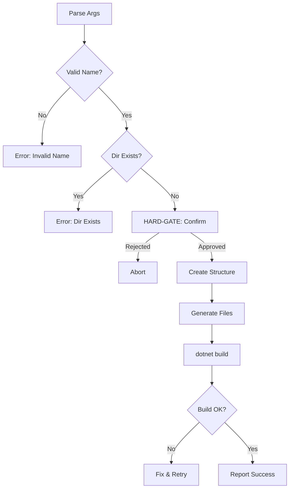

# Create NAC Solution

## Arguments

| Arg | Required | Description |
|-----|----------|-------------|
| `<SolutionName>` | Yes | PascalCase solution name |
| `--local-nac <path>` | No | Path to local NAC source (dev mode) |

## Workflow



## Steps

### 1. Validate Input
- Name: PascalCase, alphanumeric only
- Target directory must not exist

### 2. HARD-GATE: Confirm Creation
```
AskUserQuestion: "Create solution '{Name}'?
- {Name}.slnx
- src/{Name}.Host/
- nac.json, CLAUDE.md, llms.txt
Proceed?"
```

### 3. Create Structure
```
{Name}/
├── {Name}.slnx
├── nac.json
├── CLAUDE.md
├── llms.txt
└── src/{Name}.Host/
    ├── {Name}.Host.csproj
    ├── Program.cs
    └── appsettings.json
```

### 4. Generate Files
- Load `references/solution-templates.md`
- Load `references/project-docs.md`
- Replace `{Name}` placeholder
- If `--local-nac`: use ProjectReference, else PackageReference

### 5. Verify
```bash
cd {Name} && dotnet build
```

### 6. Report
- Files created
- Next: `cd {Name}` then `/nac-add-module`

## Error Recovery

| Error | Resolution |
|-------|------------|
| Directory exists | Use different name |
| Build fails | Fix refs, retry build |
| Invalid name | Enforce PascalCase |
