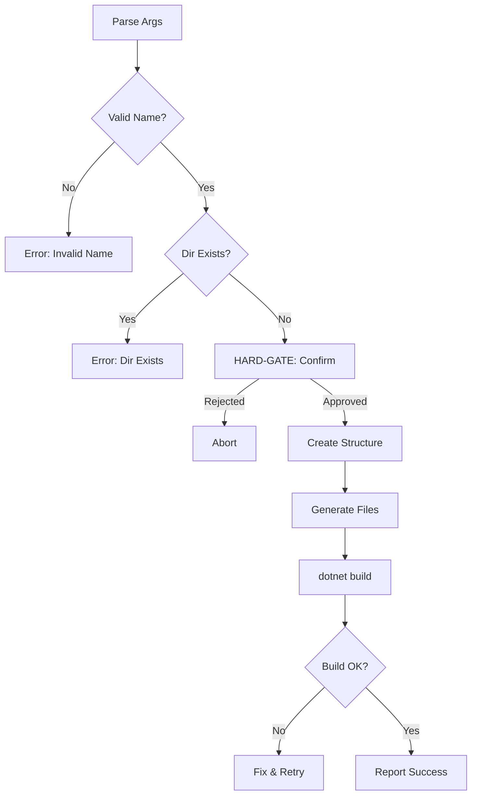

# Create NAC Solution

## Arguments

| Arg | Required | Description |
|-----|----------|-------------|
| `<SolutionName>` | Yes | PascalCase solution name |
| `--local-nac <path>` | No | Path to local NAC source (dev mode) |

## Workflow



## Steps

### 1. Validate Input
- Name: PascalCase, alphanumeric only
- Target directory must not exist

### 2. HARD-GATE: Confirm Creation
```
AskUserQuestion: "Create solution '{Name}'?
- {Name}.slnx
- Directory.Build.props, Directory.Packages.props
- src/{Name}.Host/
- nac.json, CLAUDE.md, llms.txt
Proceed?"
```

### 3. Create Structure
```
{Name}/
├── Directory.Build.props
├── Directory.Packages.props
├── {Name}.slnx
├── nac.json
├── CLAUDE.md
├── llms.txt
└── src/{Name}.Host/
    ├── {Name}.Host.csproj
    ├── Program.cs
    ├── appsettings.json
    └── Properties/
        └── launchSettings.json
```

### 4. Resolve `{NacVersion}`
- If `--local-nac <path>` provided: parse `<path>/Directory.Build.props` XML → extract `<Version>` value
- Else: query latest NuGet version via `curl -s "https://api.nuget.org/v3-flatcontainer/nac.abstractions/index.json" | jq -r '.versions[-1]'`. If query fails (package not published, network error), ask user for version via AskUserQuestion

### 5. Generate Files
- Load `references/solution-templates.md`
- Load `references/project-docs.md`
- Replace `{Name}`, `{NacVersion}`, `{localNacPath}` placeholders
- Generate `Directory.Build.props` from template
- Generate `Directory.Packages.props` (PackageReference or ProjectReference mode based on `--local-nac`)
- If `--local-nac`: use ProjectReference, else PackageReference

### 6. Verify
```bash
cd {Name} && dotnet build
```

### 7. Report
- Files created
- Next: `cd {Name}` then `/nac-add-module`

## Error Recovery

| Error | Resolution |
|-------|------------|
| Directory exists | Use different name |
| Build fails | Fix refs, retry build |
| Invalid name | Enforce PascalCase |
